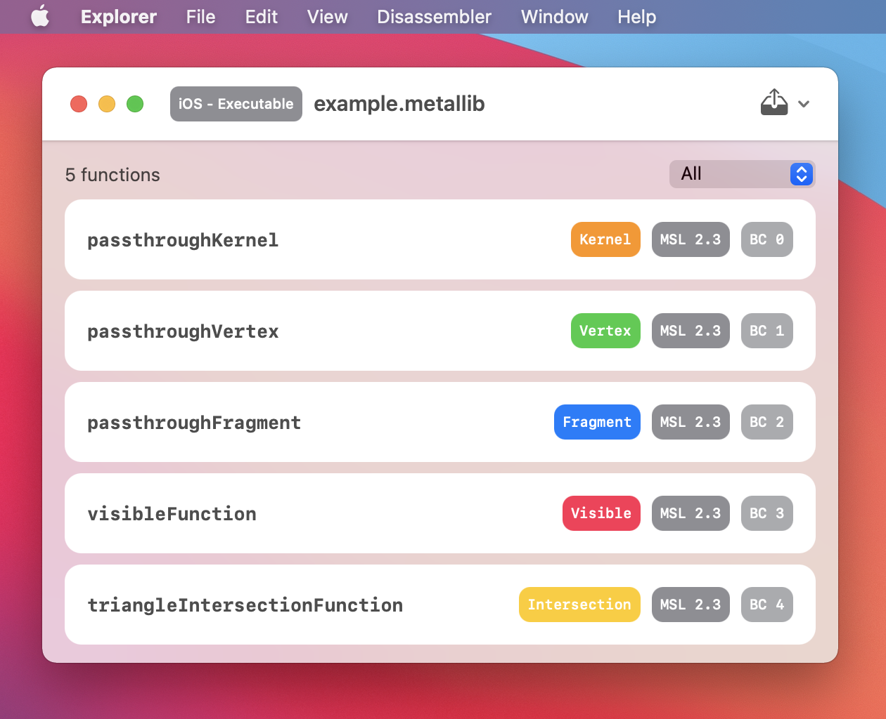

# Metal Library Archive


`MetalLibraryArchive` is a product of reverse-engineering Apple's `metallib` file format. 

You can use `MetalLibraryArchive` to get the library type, target platform, Metal functions, etc., from a `metallib` file.

The extracted information of a Metal function includes:

- Function name.
- Function type - vertex, fragment, kernel, extern, etc.
- Metal Shading Language version of the function.
- Bitcode of the function which can be converted into human-readable LLVM assembly language using [llvm-dis](https://llvm.org/docs/CommandGuide/llvm-dis.html).
- Source code of the function if the `metallib` is configured to include source code.

## 🎈 Usage

### Explorer App

An executable target called "Explorer" is included in the package. "Explorer" is a GUI app which can open, unpack and disassemble (with the help of `llvm-dis`) `metallib` files.

**Note** `llvm-dis` is not included, you can get a copy of the binary at https://github.com/llvm/llvm-project/releases

Use the "Disassembler" menu in the app to locate the `llvm-dis` executable file. 



### Library

You can also use `MetalLibraryArchive` as a library:

```Swift
import MetalLibraryArchive

let archive = try Archive(data: Data(contentsOf: metallibURL))
let libraryType = archive.libraryType
let functions = archive.functions
```

## 🚧 Metal Library Archive Binary Layout

### Header

| Byte Range | Type   | Content                       |
|------------|--------|-------------------------------|
| 0...3      | FourCharCode | MTLB |
| 4...5      | UInt16 | Target platform |
| 6...9      | (UInt16, UInt16) | Version of the metallib file (major, minor) |
| 10         | UInt8  | Type of the metallib file |
| 11         | UInt8  | Target OS |
| 12...15    | (UInt16, UInt16) | Version of the target OS (major, minor) |
| 16...23    | UInt64 | Size of the metallib file     |
| 24...39    | (UInt64, UInt64) | Offset and size of the function list  |
| 40...55    | (UInt64, UInt64) | Offset and size of the public metadata section |
| 56...71    | (UInt64, UInt64) | Offset and size of the private metadata section |
| 72...87    | (UInt64, UInt64) | Offset and size of the bitcode section  |

| Target Platform | Value |
|----|-------|
| macOS | 0x8001 (0x01,0x80)|
| iOS | 0x0001 (0x01,0x00) |

| metallib Type | Value |
|----|-------|
| Executable | 0x00 |
| Core Image | 0x01 |
| Dynamic | 0x02 |
| Symbol Companion | 0x03 |

| Target OS | Value |
|----|-------|
| Unknown | 0x00 |
| macOS | 0x81 |
| iOS | 0x82 | 
| tvOS | 0x83 |
| watchOS | 0x84 |
| bridgeOS [(Probably)](https://github.com/apple-oss-distributions/dyld/blob/419f8cbca6fb3420a248f158714a9d322af2aa5a/cache-builder/mrm_shared_cache_builder.h#L45) | 0x85 |
| macCatalyst | 0x86 |
| iOS Simulator | 0x87 |
| tvOS Simulator | 0x88 |
| watchOS Simulator | 0x89 |

### Function List

| Byte Range | Type       | Content                               |
|------------|------------|---------------------------------------|
| 0...3      | UInt32     | Entry count (the number of functions) |
| 4...       | Tag Groups | Each tag group holds some information about a Metal function |

The number of tag groups equals to the number of functions.

### Tag Group

| Byte Range | Type   | Content                |
|------------|--------|------------------------|
| 0...3      | UInt32 | Size of the tag group  |
| 4...       | Tags   |                        |

### Tag

| Byte Range | Type   | Content            |
|------------|--------|--------------------|
| 0...3      | FourCharCode | Name of the tag    |
| 4...5      | UInt16 | Size of the tag    |
| 6...       | Bytes  | Content of the tag |

### Function Information Tags

| Name | Content Data Type                | Content                                                                                    |
|------|----------------------------------|--------------------------------------------------------------------------------------------|
| NAME | NULL-terminated C-style string   | Name of the function |
| MDSZ | UInt64                           | Size of the bitcode |
| TYPE | UInt8                            | Type of the function |
| HASH | SHA256 Digest                    | Hash of the bitcode data (SHA256) |
| OFFT | (UInt64, UInt64, UInt64)         | Offsets of the information about this function in public metadata section, private metadata section and bitcode section |
| SOFF | UInt64                           | Offset of the source code archive of the function in embeded source code section |
| VERS | (UInt16, UInt16, UInt16, UInt16) | Bitcode and language versions (air.major, air.minor, language.major, language.minor) |
| LAYR | UInt8                            | Metal type ID of the `render_target_array_index` |
| TESS | UInt8                            | Patch type and number of control points per-patch (for post-tessellation vertex function) |
| ENDT |                                  | End of the tag group |

| Function Type | Value | Note                                                        |
|---------------|-------|-------------------------------------------------------------|
| Vertex        | 0x00  |                                                             |
| Fragment      | 0x01  |                                                             |
| Kernel        | 0x02  |                                                             |
| Unqualified   | 0x03  | Functions in Metal dynamic library                          |
| Visible       | 0x04  | Functions with `[[visible]]` or `[[stitchable]]` attributes |
| Extern        | 0x05  | Extern functions complied with `-fcikernel` option          |
| Intersection  | 0x06  |                                                             |

Content of the `TESS` tag:

```swift
// Patch types:
//   - triangle: 1
//   - quad: 2

let content: UInt8 = controlPointCount << 2 | patchType
```

### Public Metadata

Contains information about function constants, tessellation patches, return types, etc.

Tags: `CNST`, `VATT`, `VATY`, `RETR`, `ARGR`, etc.

### Private Metadata

Contains pathes to the shader source (`DEBI` tag) and `.air` (`DEPF` tag) files.

### Header Extension

Only exists if `FunctionListOffset + FunctionListSize + 4 != PublicMetadataOffset`

| Byte Range | Type   | Content                       |
|------------|--------|-------------------------------|
| `FunctionListOffset + FunctionListSize + 4`... | Tags | Header extension tags |

### Header Extension Tags

| Name | Type | Content |
|------|----------------------------------|------------------------|
| HDYN | (UInt64, UInt64) | Offset and size of the dynamic header section |
| VLST | (UInt64, UInt64) | Offset and size of the exported variable list | 
| ILST | (UInt64, UInt64) | Offset and size of the imported symbol list | 
| HSRD/HSRC | (UInt64, UInt64) | Offset and size of the embeded source code section |
| UUID | UUID | UUID of the Metal library. |
| ENDT |      | End of the header extension |

### Dynamic Header Section Tags

| Name | Content Data Type  | Content |
|------|----------------------------------|------------------------|
| NAME | NULL-terminated C-style string | Install name of the library |
| DYNL | NULL-terminated C-style string | Linked dynamic library | 

### Variable List & Imported Symbol List

Variable list and imported symbol list have structures that are similar to that of the function list.

### Embeded Source Code Section

Only exists if the `metallib` build process is configured to [include source code](https://developer.apple.com/documentation/metal/developing_and_debugging_metal_shaders).

| Byte Range | Type   | Content            |
|------------|--------|--------------------|
| 0...1      | UInt16 | Number of items in this section |
| 2...n      | NULL-terminated C-style string | Link options of the `metallib` file |
| n...m      | NULL-terminated C-style string | Working directory  |
| m...       | Tag Group  | `SARC` tag |

**Note** "Working directory" only exists in `HSRD`.

**Note** `SARC` tag uses 4-bytes (`UInt32`) content size.

Content of the `SARC` tag:

| Byte Range | Type   | Content            |
|------------|--------|--------------------|
| 0...n      | NULL-terminated C-style string | ID of the source code archive |
| n...       | BZh  | Bzip2 compressed source code archive |

## ❤️ Contributing

If you think there's a mistake, please open an issue. You can also choose to open a pull request with the failure test included. 

## 👾 The Story

This project would not have started without [zhuowei's research](https://worthdoingbadly.com/metalbitcode/) that revealed the basic binary layout of a `metallib` file, the function list as well as the bitcode section. Thanks, [@zhuowei](https://github.com/zhuowei)! 

### What the assembly can tell

I tried to continue the research to get a complete structure of the `metallib` file, but found it too hard to move forward based on guesswork alone. So I turned my attention to the `Metal.framework` hoping to find out how the framework loads a `metallib` file. Fortunately, it's not too hard after dragging `Metal.framework/Metal` to [Hopper Disassembler](https://www.hopperapp.com/). 

`Metal.framework` uses `MTLLibraryDataWithArchive::parseArchiveSync(...)` to load `metallib` files. There is a lot of information hidden in the assembly of `MTLLibraryDataWithArchive`. For example:

- The file starts with `0x424c544d`(MTLB); The size of the file is recorded at offset `0x10`.
    ```cpp
    int __ZN25MTLLibraryDataWithArchive16parseArchiveSyncEPP7NSErrorb(void * * arg0, bool arg1) {
      r12 = rdx;
      r14 = arg1;
      r13 = arg0;
      (*(*arg0 + 0xb8))(arg0, 0x0); //LibraryWithFile::setPosition(...)
      r15 = r13 + 0x78;
      rbx = (*(*r13 + 0xc0))(r13, r15, 0x58);  //LibraryWithFile::readBytes(...)
      rax = *r13;
      rax = (*(rax + 0xc8))(r13); //LibraryWithFile::getFileSize(...)
      
      // 0x424c544d - MTLB
      // File size field offset: 0x88 - 0x78 = 0x10
      if (((rbx != 0x58) || (*(int32_t *)(r13 + 0x78) != 0x424c544d)) || (*(r13 + 0x88) != rax)) goto loc_6a65b;
      
      ...
      
      loc_6a65b:
      if (r14 == 0x0) goto loc_6a6c5;

      loc_6a660:
      rdx = @"Invalid library file";
       
      ...
    }
    ```
    
- A `Int16` value at offset `0x4` is related to the target platform.

    ```cpp
    loc_6a610:
    // 0x7c - 0x78 = 0x4
    rax = *(int16_t *)(r13 + 0x7c) & 0xffff;
    
    if ((rax >= 0x0) || (r12 == 0x0)) goto loc_6a6ea;
    
    loc_6a627:
    if (r14 == 0x0) goto loc_6a6c5;

    loc_6a630:
    rdx = @"This library format is not supported on this platform (or was built with an old version of the tools)";
    goto loc_6a689;
    ```

- There is a "Header Extension Section" that contains information about "Dynamic Header Section", "Imported Symbol List" and "Variable List":

    ```cpp
    if (MTLLibraryDataWithArchive::parseHeaderExtension(r13, r13 + 0x100, r14) != 0x0) {
        if (MTLLibraryDataWithArchive::parseDynamicHeaderSection(r13) != 0x0) {
            if (MTLLibraryDataWithArchive::parseImportedSymbolListSection(r13) != 0x0) {
                rax = MTLLibraryDataWithArchive::parseVariableListSection(r13);
            } else {
                rax = 0x0;
            }
        } else {
            rax = 0x0;
        }
    } else {
        rax = 0x0;
    }
    ```
   
- The bitcode is validated using SHA256.

    ```cpp
    int ____ZN25MTLLibraryDataWithArchive15validateBitCodeEmmPK6NSDataRK12MTLUINT256_t_block_invoke(int arg0) {
        ...
        CC_SHA256_Init(&var_B0);
        CC_SHA256_Update(&var_B0, r14, *(int32_t *)(r15 + 0x38));
        CC_SHA256_Final(&var_48, &var_B0);
        ...
    }
    ```
    
- A lot of FourCC codes:

    ```cpp
    // 0x454e4454 - ENDT
    loc_6a8bc:
    if (rax == 0x454e4454) goto loc_6a871;
    ...
    // 0x54595045 - TYPE
    loc_6a984:
    if (rax == 0x54595045) goto loc_6a9dc;
    ...
    // 0x44594e4c - DYNL
    loc_6ae5b:
    if (rax != 0x44594e4c) goto loc_6b002;
    ...
    // 0x56455253 - VERS
    loc_6b731:
    if (rax == 0x56455253) goto loc_6b81c;
    ```

After some digging around I was able to get an overview of the `metallib` file's structure:

- The file has a 88 bytes header that contains file version, target platform, library type, section indices, etc.

- There are 4 sections recorded in the file header:
    
    - Function list
    
    - Public metadata
    
    - Private metadata
    
    - Bitcode modules

    Each section is recorded with an offset and a size. This means sections can be non-contiguous, which allows Apple to introduce new sections in between without breaking the compatibility. And Apple did that exactly for the "header extension" section - it lies between the function list and the public metadata section.
    
- Most of the sections (except the bitcode section) resemble a "tag" based structure:

    - [FourCharCode](https://en.wikipedia.org/wiki/FourCC) is used as the tag's name/type.
    
    - An `UInt16` (in most cases) value of size follows the tag's name.
    
        The source archive data tag `SARC` unsurprisingly uses an `UInt32` value for its size - a source archive can easily exceed 65KB.
    
    - Tags are grouped:
    
        - Each group represents a set of properties of an item. 
        
        - Tag group ends with an `ENDT` tag.

### TDG - "Test Driven Guessing"

Next, I need to figure out what information each tag/field holds. This can be hard to get from the assembly of the `Metal.framework` because:

- Some fields may be designed purely for tooling or debugging, so `MTLLibraryDataWithArchive` may just ignore them.

- The assembly is platform dependent. For example, the iOS version of `MTLLibraryDataWithArchive` may only check whether the `metallib` is built for iOS and cannot tell if the library is built for macOS.

- Some fields are just hard to analyze and follow. Examples:
    
    - There are 3 offsets in the `OFFT` tag of the function, where are they pointing to? and how are they finally used?
    
    - What are the possible values of the function type? What does each value mean?

It seems that the quickest way to get this information is through experiments.

I started by manually compiling `metal` files with different shaders, options and SDKs, then inspecting each field I was interested in. My desktop was quickly flooded with `metallib` files and [HexFiend](https://hexfiend.com/) windows, but I didn't find much useful information. I need something that can automatically build `metallib` and presents me only the field that I'm interested in.

I came up with the "Test Driven Guessing":

1. Write a `metallib` parser based on the binary structure overview at hand.

2. In the parser, log the value of a field/tag (or some related fields) that is currently unknown.

3. Create tests that produce `metallib` files using different kinds of shaders and compile options that may affect the value of the field, and use the parser to parse the file data.

4. Run tests and analyze the log to make hypotheses.

5. Update the parser based on hypotheses.

6. Run tests again to verify.

After a few rounds, I was able to get the function type table, target OS table, and the meaning of 3 offsets in the `OFFT` tag.

I also found a few things interesting in this process:

- Metal does not support watchOS, however it is possible to build a `metallib` targeting watchOS. And Apple does include some `metallib`s in the watchOS SDK. (e.g. `Xcode.app/Contents/Developer/Platforms/WatchOS.platform/Library/Developer/CoreSimulator/Profiles/Runtimes/watchOS.simruntime/Contents/Resources/RuntimeRoot/System/Library/Frameworks/CoreImage.framework/ci_filters.metallib`)

- Empty `metallib`s targeting old versions of iOS are [mistakenly marked as targeting macOS](https://github.com/YuAo/MetalLibraryArchive/blob/da16437b0549c7b21408e51b210627f73e323cbf/Tests/MetalLibraryArchiveTests/Tests.swift#L559).

- I cannot build a `metallib` that has the target OS value `0x85`. At first I thought it might be reserved for the concealed [realityOS](https://github.com/apple-oss-distributions/dyld/blob/5c9192436bb195e7a8fe61f22a229ee3d30d8222/common/MachOFile.cpp#L578), but later found out it is [more likely for the bridgeOS](https://github.com/apple-oss-distributions/dyld/blob/419f8cbca6fb3420a248f158714a9d322af2aa5a/cache-builder/mrm_shared_cache_builder.h#L45).

### Updates

**Mar 31, 2022** 

The `air-lld` (`Xcode.app/Contents/Developer/Toolchains/XcodeDefault.xctoolchain/usr/metal/ios/bin/air-lld`) also provides a lot of information about how the `metallib` file is built. Some section names and descriptions are updated.

```
int __ZN4llvm3air20MetalLibObjectWriter5writeEv() {
    r14 = rdi;
    rax = llvm::air::MetalLibObjectWriter::writeHeader();
    if (rax != 0x0) goto loc_1000351b9;

loc_100035135:
    rax = llvm::air::MetalLibObjectWriter::writeFunctionList();
    if (rax != 0x0) goto loc_1000351b9;

loc_100035141:
    rax = llvm::air::MetalLibObjectWriter::writeHeaderExtension();
    if (rax != 0x0) goto loc_1000351b9;

loc_10003514d:
    rax = llvm::air::MetalLibObjectWriter::writePublicMetadata();
    if (rax != 0x0) goto loc_1000351b9;

loc_100035159:
    rax = llvm::air::MetalLibObjectWriter::writePrivateMetadata();
    if (rax != 0x0) goto loc_1000351b9;

loc_100035165:
    rax = llvm::air::MetalLibObjectWriter::writeModuleList();
    if (rax != 0x0) goto loc_1000351b9;

loc_100035171:
    rax = llvm::air::MetalLibObjectWriter::writeSources();
    if (rax != 0x0) goto loc_1000351b9;

loc_10003517d:
    rax = llvm::air::MetalLibObjectWriter::writeDynamicHeader();
    if (rax != 0x0) goto loc_1000351b9;

loc_100035189:
    rax = llvm::air::MetalLibObjectWriter::writeVariableList();
    if (rax != 0x0) goto loc_1000351b9;

loc_100035195:
    rax = llvm::air::MetalLibObjectWriter::writeImportedSymbolList();
    if (rax != 0x0) goto loc_1000351b9;

loc_1000351a1:
    rax = llvm::air::MetalLibObjectWriter::computeUUID();
    if (rax != 0x0) goto loc_1000351b9;

loc_1000351ad:
    rax = llvm::air::MetalLibObjectWriter::backpatchAllLocations();
    if (rax == 0x0) goto loc_1000351c2;

loc_1000351b9:
    rbx = rax;
    goto loc_1000351bb;

loc_1000351bb:
    rax = rbx;
    return rax;

loc_1000351c2:
    rbx = 0x0;
    std::__1::system_category();
    goto loc_1000351bb;
}
```
